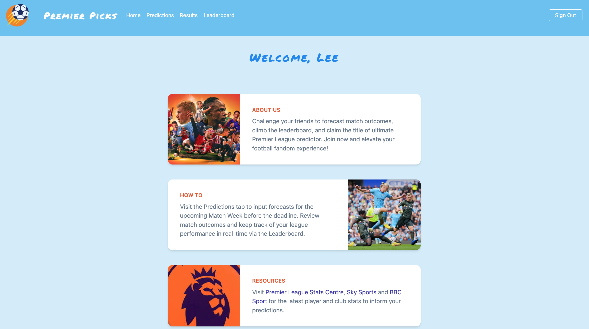
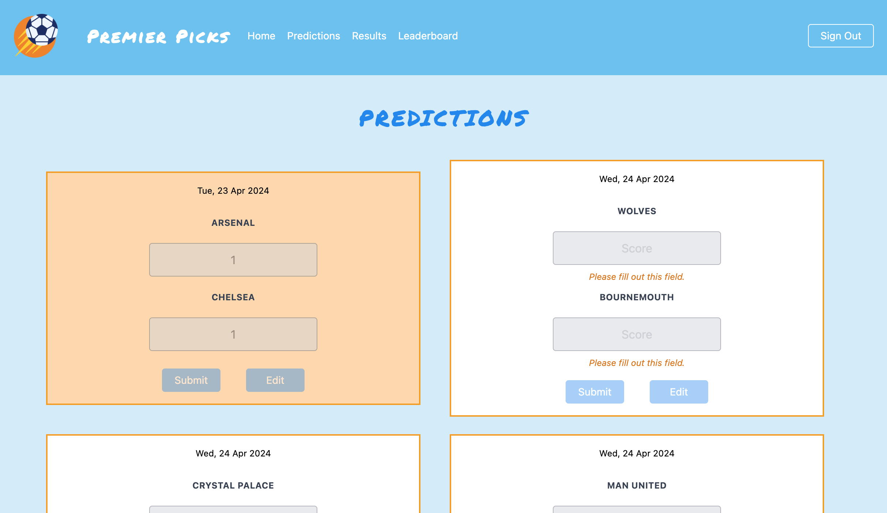
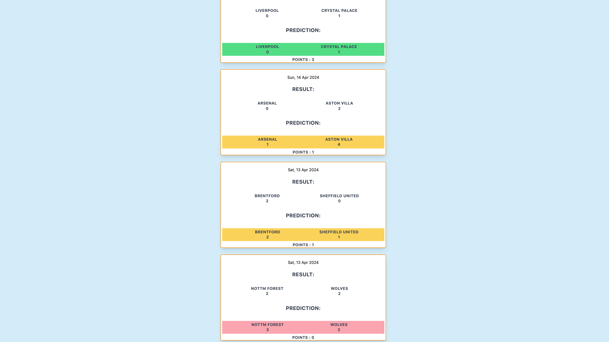
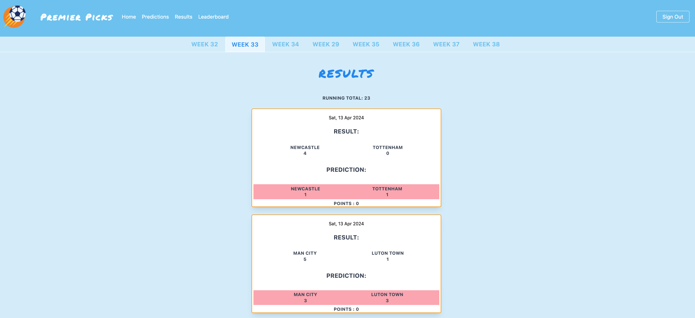
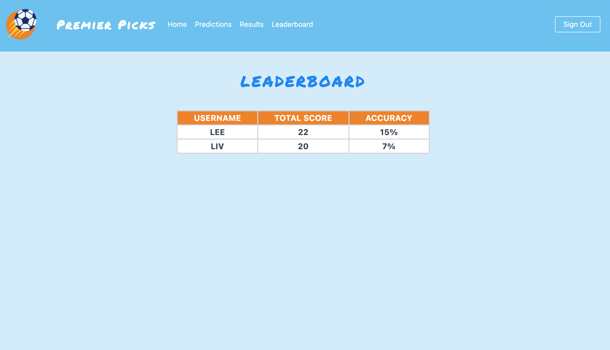

# Premier Picks



## Project Description

Premier Picks is a predictions app, which allows users to join a league and submit predictions for the upcoming Premier League Match Week.

Users can edit their predictions up to the day before the match takes place, at which point the edit functionality is disabled.

This project was inspired by seeing friends editing and updating complicated Excel spreadsheets manually each week for their predictions league. Some of the painpoints included:

- Manually updating upcoming matches is time-consuming and relies on one person taking admin ownership. This causes bottlenecks whenever the admin is unavailable.
- Someone has to review each members' predictions against the match results each week and update the user score. Imagine a league of 10 people with 10 matches per week... that's a lot of admin!
- When a match starts, most leagues rely on good faith from their members, in the hopes that they don't retrospectively update their prediction when no one's looking.
- And finally, user error happens!

<br>Check out Premier Picks here: https://premier-picks.netlify.app/



## Installation Instructions

**Font-end:**

- Clone the front-end repository to your local machine.
- Navigate to the root of the project directory.
- `npm install` to install all dependencies.
- To install Tailwind, run `npm install -D tailwindcss postcss autoprefixer` and `npx tailwindcss init -p`
- `npm run dev` to start the development server.

**Backend:**
<br>_Prerequisites:_
Ensure you have pipenv installed. If not, you can install it using `pip install pipenv`.

Installation Commands:

- Run the following commands to set up your environment and install all necessary dependencies:

```
pipenv install
pipenv install Flask-SQLAlchemy psycopg2-binary Flask-Marshmallow marshmallow-sqlalchemy flask_bcrypt pyjwt pytest
```

- To start the API server, use: `pipenv run flask run`. You should get the following message, in your terminal:
  `Running on http://127.0.0.1:4000`
- To seed your database, run: `pipenv run python seed.py`

## Brief

This project took place in the final week of General Assembly's Software Engineering bootcamp. I choose to do this as a solo project.

The brief was to build a full-stack application, using a Python Flask API using a Flask REST Framework and to serve your data from a Postgres database. The API must be consumed with a separate front-end built with React.

## Technologies Used

- ReactJS
- Axios
- Tailwind CSS
- TypeScript
- Flask
- Flask SQL Alchemy
- Flask Marshmallow
- Bcrypt
- PyJWT
- Heroku
- Insomnia
- TablePlus for data visualisation
- Canva for wireframing

## Planning

I used Canva to wireframe my project, including a moodboard for styling, the pages and main components I wanted to include and pseudocoding for the public API that I planned for my database to consume.


## Build/Code Process

### Day One: Planning

This day was spent planning, wireframing and pseudocoding.

I wanted to use [SerpAPI](https://serpapi.com/sports-results) (Google Search Results) to pull weekly matches and results from Google, to post to my database and render on the frontend. I spent day one testing the API functionality and identified a number of potential challenges:

- The API only allows you to make 100 searches per month on the free plan.
- My Heroku credits wouldn't cover running scheduled scripts.
- The API is very inconsistent with the format and type of data returned.

### Day Two: Cleaning the API Data

I identified that the results I needed from the API response were in the sports_results key.

However, when using 'Premier League' in the search query, the API only returns 5 or 6 sports results i.e. it cannot return anything in the 'See More' section of the Google Search Result (see screenshot below).


To get around this I created a list of all Premier League club names, looping through and using the club name as the API search query. This returned upcoming Premier League matches and most recent results, but also returned other tournaments like FA and EFL Cup. Dates were also inconsistent so had to be cleaned and standardised using datetime, timezone and timedelta.

```
@router.route("/new/matches/<club_name>", methods=["GET"])
def get_new_matches(club_name):

    premier_league_matches = []

    def fetch_matches():
        params = {
            "q": club_name,
            "api_key": API_KEY,
        }
        search = GoogleSearch(params)
        results = search.get_dict()

        matches = results.get("sports_results", {})
        matches_games = matches.get("games", [])

        matches_spotlight = matches.get("game_spotlight")

        a = []

        if matches_spotlight:
            a.append(matches_spotlight.copy())

        matches = matches_games + a
        pprint.pp(matches)

        premier_league_matches = [
            match
            for match in matches
            if match.get("tournament") == "Premier League"
            or match.get("league") == "Premier League"
        ]
        return premier_league_matches

    premier_league_matches = fetch_matches()

    def formatted_date(string):
        if "yesterday" in string or "Yesterday" in string:
            return datetime.now(timezone.utc) - (timedelta(days=1))
        if "today" in string:
            return datetime.now(timezone.utc)
        elif "," in string:
            return datetime.strptime(string, "%a, %b %d").replace(
                year=datetime.now().year
            )
        return datetime.strptime(string, "%b %d").replace(year=datetime.now().year)

    filtered_matches = []
    for match in premier_league_matches:

        filtered_teams = []

        for team in match["teams"]:
            team_info = {"name": team["name"]}
            if "score" in team:
                team_info["score"] = team["score"]
            filtered_teams.append(team_info)

        filtered_match = {
            "date": formatted_date(match["date"]),
            "teams": filtered_teams,
        }
        filtered_matches.append(filtered_match)

    return filtered_matches, HTTPStatus.OK
```

I then made the route to POST the matches to the database, only if the match does not already exist.

```
@router.route("/matches", methods=["POST"])
@secure_route
def create():

    match_dictionary = request.json
    match_model = match_serializer.load(match_dictionary)

    def check_if_match_existing(team_one_name, team_two_name):
        match = (
            db.session.query(MatchModel)
            .filter(
                func.lower(MatchModel.team_one_name) == func.lower(team_one_name),
                func.lower(MatchModel.team_two_name) == func.lower(team_two_name),
            )
            .first()
        )
        print(match)
        return match

    try:

        existing_match = check_if_match_existing(
            match_model.team_one_name, match_model.team_two_name
        )

        if existing_match:
            return {"message": "Match already exists."}, HTTPStatus.CONFLICT

        datetime_object = datetime.strptime(match_model.match_date, "%Y-%m-%dT%H:%M")
        formatted_string = datetime_object.strftime("%a, %d %b %Y %H:%M:%S GMT")
        match_model.match_date = formatted_string
        match_model.date_created = datetime.now(timezone.utc)

        db.session.add(match_model)
        db.session.commit()
        return match_serializer.jsonify(match_model), HTTPStatus.OK

    except ValidationError as e:
        return {
            "errors": e.messages,
            "message": "Please check the required fields and try again.",
        }, HTTPStatus.UNPROCESSABLE_ENTITY
```

### Day Three: Backend Controllers

Once I'd got my head around the public API, I focused on setting up my other routers, including sign-up, login, posting a prediction and getting all user predictions.

I used the @password.setter decorator in the UserModel and the password function which takes the plain text password, and generates a hashed version using the generate_password_hash function provided by the bcrypt library.

```
@password.setter
    def password(self, password_plaintext):
        encoded_hashed_pw = bcrypt.generate_password_hash(password_plaintext)
        self.password_hash = encoded_hashed_pw.decode("utf-8")
```

I made the password_hash, email and password load_only in the UserSerializer for privacy reasons.

For login, the validate_password function in the user model checks the login_password against the password_has using the bcrypt library:

```
def validate_password(self, login_password):
        return bcrypt.check_password_hash(self.password_hash, login_password)
```

I used jwt to transmit a token on login, which was then used in the secure_route middleware for authorisation.

### Day Four: Setting up the Front-End

I started by creating the Router in the App.tsx with the main page components and Navbar.

The Predictions component is where users input their predictions for the upcoming week. My first idea was to use a useEffect() hook to send a HTTP request to the public API whenever the predictions component mounted.

```
async function fetchMatches() {
    for (const club of premierLeagueClubs) {
      const resp = await fetch(`${baseUrl}/new/matches/${club}`);
      const data = await resp.json();
      const filtered_data = data.filter((match: any) =>
        checkDates(
          new Date(match.date).toLocaleDateString(),
          lastSunday,
          nextSunday
        )
      );
      clubsToRender = [...clubsToRender, ...filtered_data];
      clubsFetched++;
      if (clubsFetched === premierLeagueClubs.length) {
        setMatches(clubsToRender);
      }
    }
  }

  // Commenting this out to save api searches ^

  // React.useEffect(() => {
  //   fetchMatches()
  // }, []);
```

However, this was draining my API search allowance especially during the development stage so I seeded the database with the matches and commented out the useEffect() Hook for the timebeing.

I looped through the matches, rendering a MatchCard for each. The MatchCard includes a form with team_one_score and team_two_score. I used useState to dynamically update the styling and error handling depending on whether a prediction has been submitted.

Each input field is prepopulated with the user's prediction for that match if a prediction has already been submitted.

```
async function getPredictionsByUser(id: any) {
    const resp = await fetch(`${baseUrl}/predictions/${user.id}`, {
      headers: { Authorization: `Bearer ${token}` },
    });
    const data = await resp.json();
    const filtered_data = data.filter((prediction: any) => {
      return prediction.match.id === id;
    });
    setPredictions(filtered_data);
    if (filtered_data.length > 0) {
      setPredictionSubmitted(true);
    }
  }
```

The handleChange() and handleSubmit() function contain logic to update the formData useState using a structuredClone and send the predictions to the back end using either a PUT request (if the user is editing a previous prediction) or POST request (if this is the user's first match prediction).

```
async function handleSubmit(e: SyntheticEvent) {
    const token = localStorage.getItem("token");
    e.preventDefault();
    if (selectedEdit) {
      await axios.put(`${baseUrl}/predictions/${predictions[0].id}`, formData, {
        headers: { Authorization: `Bearer ${token}` },
      });
    } else {
      await axios.post(`${baseUrl}/predictions`, formData, {
        headers: { Authorization: `Bearer ${token}` },
      });
    }
}
```

### Day Five - Six: Checking User Results & Updating User Score

I created an endpoint in the backend that takes the prediction_id as the params and uses the ForeginKey `match_id` to find the corresponding MatchModel in the database. This then uses logic to determine how many points are awarded to the user depending on their prediction and the match result.

- Correct score prediction: 3 points
- Correct outcome prediction (but incorrect score): 1 point
- Incorrect score and outcome prediction: 0 points

```
@router.route("/predictionresult/<int:prediction_id>")
@secure_route
def check_prediction(prediction_id):
    try:
        prediction = db.session.query(PredictionModel).get(prediction_id)
        matches = MatchModel.query.all()
        filtered_matches = []
        for match in matches:
            if match.id == prediction.match.id:
                filtered_matches.append(match)
        match = filtered_matches[0]
        print(prediction, match)
        if prediction.team_one_score == match.team_one_score and prediction.team_two_score == match.team_two_score:
            points = 3
        elif prediction.team_one_score == prediction.team_two_score and match.team_one_score == match.team_two_score:
            points = 1
        elif prediction.team_one_score > prediction.team_two_score and match.team_one_score > match.team_two_score:
            points = 1
        elif prediction.team_one_score < prediction.team_two_score and match.team_one_score < match.team_two_score:
            points = 1
        else:
            points = 0
        return {"points": points}, HTTPStatus.OK
    except SQLAlchemyError:
        return {"message" : "There has been an error"}
```

In the frontend, the predictions by user are fetched and the predictions array is looped through, with the checkPoints() function called for each prediction_id.

```
async function checkPoints() {
const resp = await fetch(`${baseUrl}/predictionresult/${prediction.id}`, {
headers: { Authorization: `Bearer ${token}` },
});
const data = await resp.json();
setPoints(data.points);
}
```

The predictions are dynamically checked each time a Match Week is selected, with logic to update the background colour to represent the points awarded (3 points = green, 1 point = amber, 0 points = red).



I used another backend endpoint to sum all user points which is rendered at the top of the results page in the front-end. This score is posted to the user model in the backend.



### Day Seven: Leaderboard and CRON
My stretch goal was to create a leaderboard for all people in the league, show total user points and accuracy score. 

I used a HTTP GET request with the ```/all_accuracy``` endpoint to query all users from the database (slicing off the first user, since this is the admin). The function then loops through each user in the list, appending predictions to the predictions_by_user list, and appending 1 to the accuracy_list for each prediction that correctly guessed the match score and outcome. For each user, the response includes the number_of_accurate_games, games_guessed and accuracy_score. 

```
@router.route("/all_accuracy", methods=["GET"])
@secure_route
def get_all_accuracy():
    try:
        users = UserModel.query.all()
        print(users)
        users = users[1::]
        print(users)
        user_info = []
        for user in users:
            predictions = PredictionModel.query.all()
            # print(predictions)
            predictions_by_user = []
            for prediction in predictions:
                if prediction.user_id == user.id:
                    predictions_by_user.append(prediction)
            accuracy_list = []
            for prediction in predictions_by_user:
                match = db.session.query(MatchModel).get(prediction.match_id)
                if (
                    prediction.team_one_score == match.team_one_score
                    and prediction.team_two_score == match.team_two_score
                ):
                    accuracy_list.append(1)

            print(accuracy_list)
            user_info.append(
                { "user_id" : user.id,
                    "number-of-accurate-games": sum(accuracy_list),
                    "games_guessed": len(predictions_by_user),
                    "accuracy_score": sum(accuracy_list)
                    / len(predictions_by_user)
                    * 100,
                }
            )
        return {"message" : user_info}

    except SQLAlchemyError:
        return {"message": "There has been an error"}
```

I also sorted the user scores in descending order in the Leaderboard.

```
 if (users && !sortedUsers) {
    const sortedArray = users.sort(
      (a: any, b: any) => b.total_score - a.total_score
    );
    setSortedUsers(sortedArray);
  }
```



Now that I had my MVP, I spent some time looking into CronJobs and setting up a script to seed my database from the SerpAPI on a weekly basis. I created a testing.py script that successfully looped through the premier_league_clubs list, cleaned the data, filtered out historic matches and removed duplicates before posting to the db. I then set up the following CronJob :

```
0 0 * * 3 /usr/local/bin/python3 /Users/Liv/Desktop/project-4/project-4-backend/testing.py
```

I wasn't able to get this working with the time I had available. I've never worked with CronJobs before so this was totally new to me, but I'd like to spend more time reading up on this to get it working!

### Day Eight: Deployment & Presentations
I deployed using Heroku and presented my project and code to the class. This was a great opportunity to reflect on everything I'd implemented and learnt over the past week!

## Challenges
My main challenge was working with the public API. I spent a lot of time querying it and cleaning the data, but unfortunately I wasn't able to use this code in my project, due to a limited search allowance and inability to set up the CronJob.

Another challenge was getting the user results to update when clicking between the different Match Weeks in the frontend. Often the points and/or background colours were glitching and not updating dynamically. I used a dependency array to have the checkPredictions() function called through the useEffect only once the matches for the selected Match Week are successfully fetched.

## Wins
The responsive design was a big win with features like a hamburger menu for mobile view. I also really enjoyed implementing dynamic styling to improve the user experience, such as disabling submit and edits buttons, rendering input field prompts and error handling.

Getting the total scores and accuracy scores through a backend route was also a big win for me. My tendancy is to think that this code should be written on the frontend, but I got really comfortable utilising different endpoints to send back exactly the information I needed my frontend to consume. 

## Key Learnings/Takeaways
- I learnt how to use a new CSS framework, Tailwind.
- I learnt how to create a proxy between the external data source (Google Search via SerpApi) and the database. I learnt how to write code that fetches, processes, and stores data from the external source into the database, effectively acting as an intermediary or proxy for the data flow. This is not something we had covered in class and was a great learning experience.
- It can take time to manipulate reponses from a Public API into a format that works for your use case.
- User stories are invaluable when it comes to prioritising features and improving the UX/UI.

## Bugs
- The Members Login button is a bit glitchy and sometimes only appears under the hamburger menu (not on desktop full screen). I need to check the JS dispaly logic to fix this.

## Future Improvements
Seeing Premier Picks come to life has been so exciting. I am keen to continue developing the site in the hopes that it can be used publically for next season. 

My wishlist of improvements includes:
- Removing all hard coding for Match Weeks. Instead use a calendar format for users to switch between weeks. 
- I have added an admin user account to post matches and results. However, I'd still like to see if I can automate this process through an API and CronJob.
- Users should be given a breakdown of their points per week, rather than just a running total. 
- I'd like to add functionality to create a league and invite friends. Users then have to use their league's invite code during sign-up to successfully create an account. 
- The leaderboard should rank user score and accuracy for all users within their league. I'd also like a 'Global Leaderboard' that shows the user's peformance across all users in all leagues.