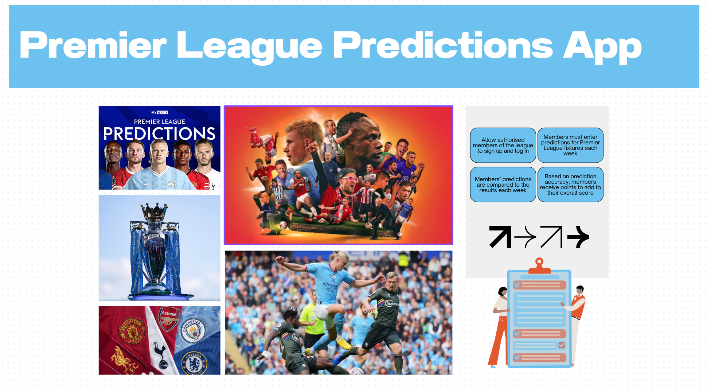
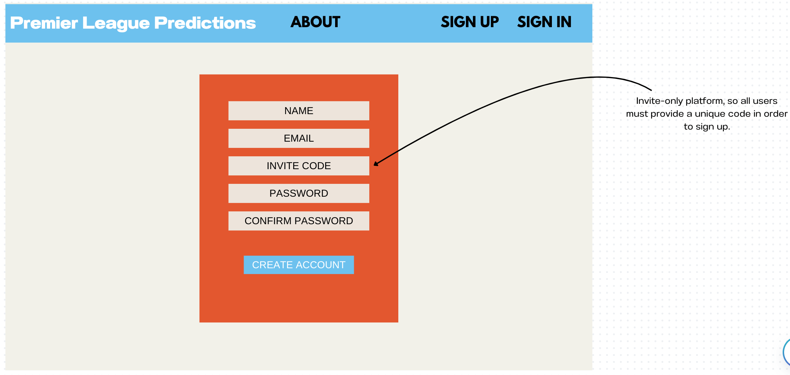
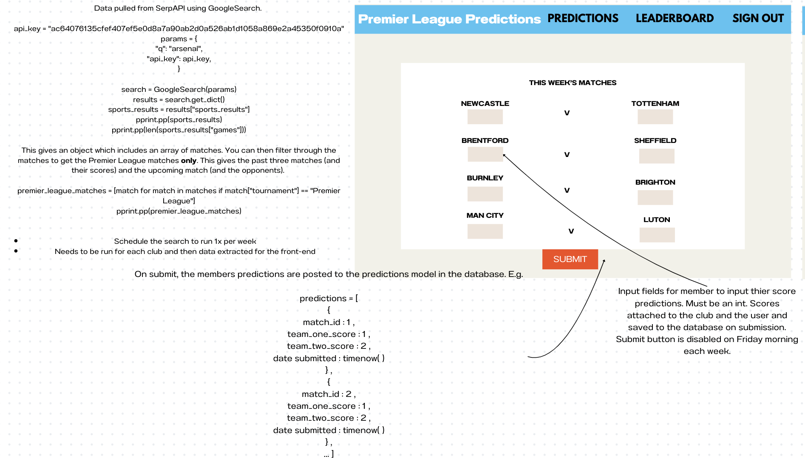
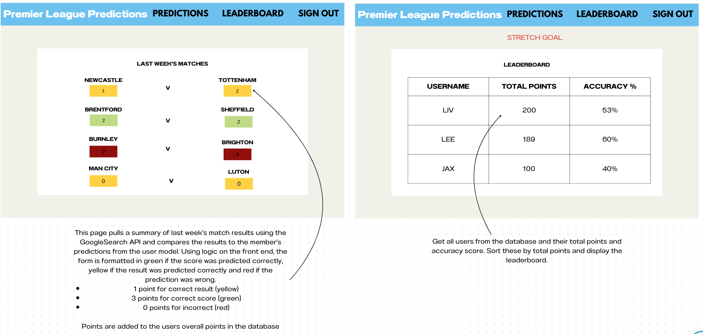
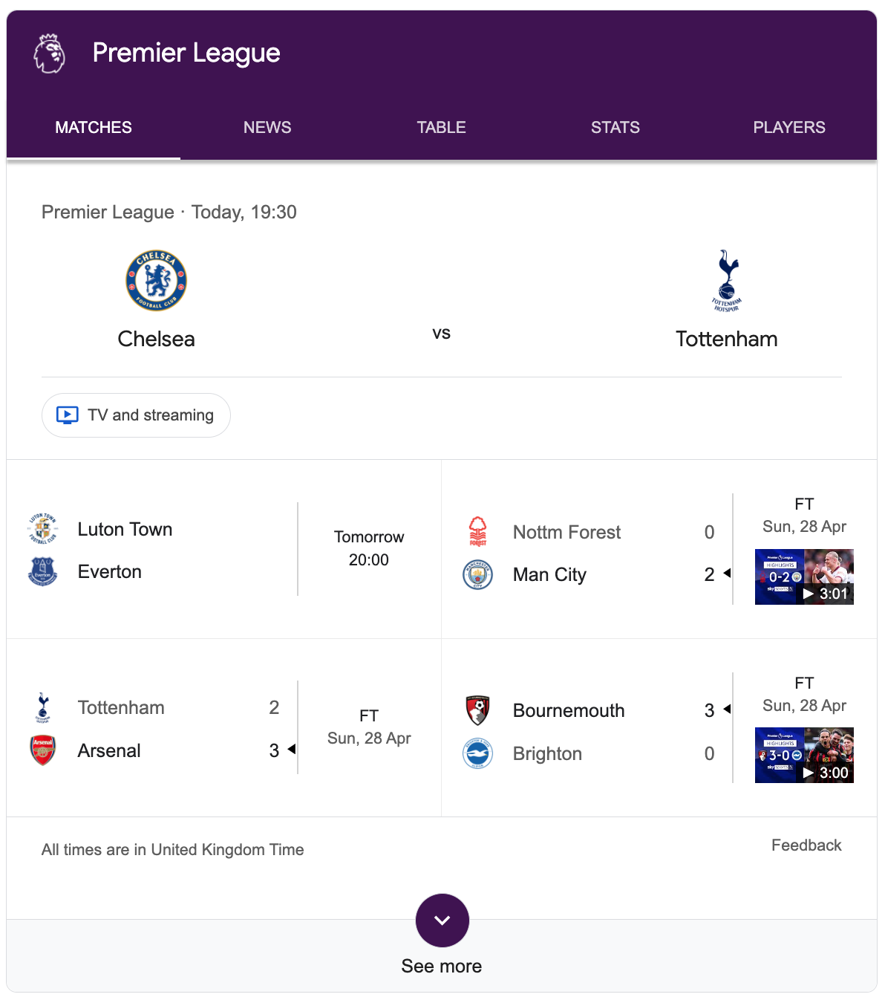

# Premier Picks

## Projet Description
Premier Picks is a predictions app, which allows users to join a league and submit predictions for the upcoming Premier League Match Week. 

Users can edit their predictions up to the day before the match takes place, at which point the edit functionality is disabled.

This project was inspired from seeing friends editing and updating complicated Excel spreadsheets manually each week for their predictions league. Some of the painpoints included:
- Manually updating upcoming matches is time-consuming and relies on one person taking admin ownership. This causes bottlenecks whenever the admin is unavailable.
- Someone has to review each members' predictions against the match results each week, and update the user score. Imagine a league of 10 people with 10 matches per week... that's a lot of admin!
- When a match starts, most leagues rely on good faith from their members, in the hopes that they don't retrospectively update their prediction when noone's looking.
- And finally, user error happens!

<br>Check out Premier Picks here: https://premier-picks.netlify.app/

## Installation Instructions
**Font-end:**
- Clone the front-end repository to your local machine.
- Navigate to the root of the project directory.
- ```npm install``` to install all dependencies.
- To install Tailwind, run ```npm install -D tailwindcss postcss autoprefixer``` and ```npx tailwindcss init -p```
- ```npm run dev``` to start the development server.

**Backend:**
<br>_Prerequisites:_
Ensure you have pipenv installed. If not, you can install it using ```pip install pipenv```.

Installation Commands:
- Run the following commands to set up your environment and install all necessary dependencies:
```
pipenv install
pipenv install Flask-SQLAlchemy psycopg2-binary Flask-Marshmallow marshmallow-sqlalchemy flask_bcrypt pyjwt pytest
```

- To start the API server, use: ```pipenv run flask run```. You should get the following message, in your terminal:
```Running on http://127.0.0.1:4000```
- To seed your database, run: ```pipenv run python seed.py```

## Brief
This project took place in the final week of General Assembly's Software Engineering bootcamp. I choose to do this as a solo project.

The brief was to build a full-stack application, using a Python Flask API using a Flask REST Framework and to serve your data from a Postgres database. The API must be consumed with a separate front-end built with React.

## Technologies Used
- ReactJS
- Axios
- Tailwind CSS
- TypeScript
- Flask
- Flask SQL Alchemy
- Flask Marshmallow
- Bcrypt
- PyJWT
- Heroku
- Insomnia
- TablePlus for data visualisation
- Canva for wireframing

## Planning
I used Canva to wireframe my project, including a moodboard for styling, the pages and main components I wanted to include and pseudocoding for the public API that I planned for my database to consume.






## Build/Code Process
### Day One: Planning
This day was spent planning, wireframing and pseudocoding. 

I wanted to use [SerpAPI](https://serpapi.com/sports-results) (Google Search Results) to pull weekly matches and results from Google, to post to my database and render on the frontend. I spent day one testing the API functionality and identified a number of potential challenges:
- The API only allows you to make 100 searches per month on the free plan.
- My Heroku credits wouldn't cover running scheduled scripts.
- The API is very inconsistent with the format and type of data returned. 

### Day Two: Cleaning the API Data
I indentified that the results I needed from the API response was the sports_results key.

However when using 'Premier League' in the search query, the API only returns 5 or 6 sports results i.e. it cannot return anything in the 'See More' section of the Google Search Result (see screenshot below).



To get around this I created a list of all Premier League club names, looping through and using the club name as the API search query. This returned upcoming Premier League matches and most recent results, but also returns other tournaments like FA and EFL Cup. Dates were also inconsistent so had to be cleaned and standardised using datetime, timezone and timedelta.

```
@router.route("/new/matches/<club_name>", methods=["GET"])
def get_new_matches(club_name):

    premier_league_matches = []

    def fetch_matches():
        params = {
            "q": club_name,
            "api_key": API_KEY,
        }
        search = GoogleSearch(params)
        results = search.get_dict()

        matches = results.get("sports_results", {})
        matches_games = matches.get("games", [])

        matches_spotlight = matches.get("game_spotlight")

        a = []

        if matches_spotlight:
            a.append(matches_spotlight.copy())

        matches = matches_games + a
        pprint.pp(matches)

        premier_league_matches = [
            match
            for match in matches
            if match.get("tournament") == "Premier League"
            or match.get("league") == "Premier League"
        ]
        return premier_league_matches

    premier_league_matches = fetch_matches()

    def formatted_date(string):
        if "yesterday" in string or "Yesterday" in string:
            return datetime.now(timezone.utc) - (timedelta(days=1))
        if "today" in string:
            return datetime.now(timezone.utc)
        elif "," in string:
            return datetime.strptime(string, "%a, %b %d").replace(
                year=datetime.now().year
            )
        return datetime.strptime(string, "%b %d").replace(year=datetime.now().year)

    filtered_matches = []
    for match in premier_league_matches:

        filtered_teams = []

        for team in match["teams"]:
            team_info = {"name": team["name"]}
            if "score" in team:
                team_info["score"] = team["score"]
            filtered_teams.append(team_info)

        filtered_match = {
            "date": formatted_date(match["date"]),
            "teams": filtered_teams,
        }
        filtered_matches.append(filtered_match)

    return filtered_matches, HTTPStatus.OK
```

I then made the route to POST the matches to the database, only if the match does not already exist. 

```
@router.route("/matches", methods=["POST"])
@secure_route
def create():

    match_dictionary = request.json
    match_model = match_serializer.load(match_dictionary)

    def check_if_match_existing(team_one_name, team_two_name):
        match = (
            db.session.query(MatchModel)
            .filter(
                func.lower(MatchModel.team_one_name) == func.lower(team_one_name),
                func.lower(MatchModel.team_two_name) == func.lower(team_two_name),
            )
            .first()
        )
        print(match)
        return match

    try:

        existing_match = check_if_match_existing(
            match_model.team_one_name, match_model.team_two_name
        )

        if existing_match:
            return {"message": "Match already exists."}, HTTPStatus.CONFLICT

        datetime_object = datetime.strptime(match_model.match_date, "%Y-%m-%dT%H:%M")
        formatted_string = datetime_object.strftime("%a, %d %b %Y %H:%M:%S GMT")
        match_model.match_date = formatted_string
        match_model.date_created = datetime.now(timezone.utc)

        db.session.add(match_model)
        db.session.commit()
        return match_serializer.jsonify(match_model), HTTPStatus.OK

    except ValidationError as e:
        return {
            "errors": e.messages,
            "message": "Please check the required fields and try again.",
        }, HTTPStatus.UNPROCESSABLE_ENTITY
```

### Day Three: Backend Controllers
Once I'd got my head around the public API, I focused on setting up my other routers, including sign up, log in, posting a prediction and getting all user predictions. 

I used the @password.setter decorator in the UserModel and the password function which takes the plain text password, and generates a hashed version using the generate_password_hash function provided by the bcrypt library. 

```
@password.setter
    def password(self, password_plaintext):
        encoded_hashed_pw = bcrypt.generate_password_hash(password_plaintext)
        self.password_hash = encoded_hashed_pw.decode("utf-8")
```

I made the password_hash, email and password load_only in the UserSerializer for privacy reasons.

For log in, the validate_password function in the user model checks the login_password against the password_has using the bcrypt library:

```
def validate_password(self, login_password):
        return bcrypt.check_password_hash(self.password_hash, login_password)
```

I used jwt to transmit a token on login, which was then used in the secure_route middleware for authorisation. 

### Day Four: Setting up the Front-End
